<!--markdownlint-disable MD045-->

# 领地系统

## 创建领地

领地支持自动创建与手动创建两种方式

### 1.手动创建

使用圈地工具（默认为箭矢），依次使用左键点选领地长方体区域的第一个点、右键点击长方体区域的第二个点。然后使用 `/dominion create <领地名称>` 创建领地。领地名称不可与其他领地重复。

### 2.自动创建

以玩家为中心自动创建一定区域的领地。 使用 `/dominion` 打开主菜单，点击创建领地：

:::tabs

@tab TUI


@tab CUI


:::

在聊天栏中输入你要创建的领地名称：


输入完成后回车发送，即可以你为中心自动创建一块领地：


## 领地列表&管理领地

### 打开列表

使用 `/dominion` 打开主菜单，点击 `【领地列表】` 或者使用指令 `/dominion list` 打开领地列表：

:::tabs

@tab TUI

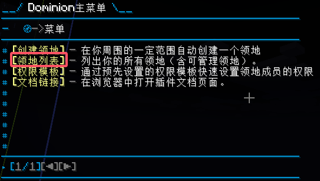

@tab CUI

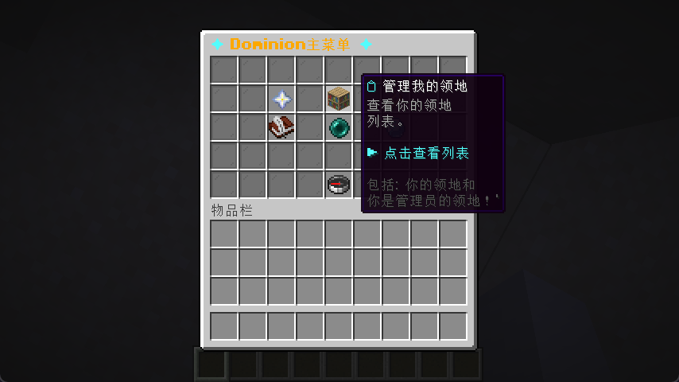

:::

领地列表展示了你可以管理的所有领地，包括你拥有的领地、你是管理员的领地、以及你在其他服务器的领地（如果管理员启用了跨服）：

:::tabs

@TUI

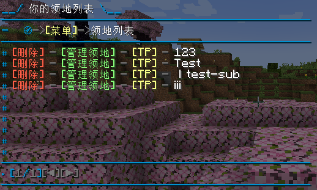

@CUI

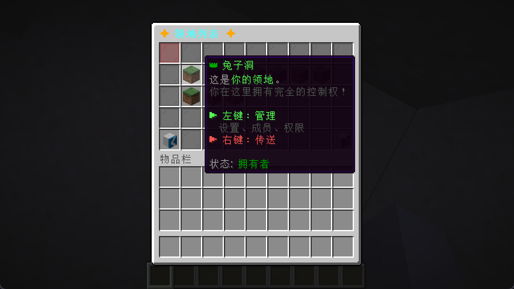

:::

### 管理页面

通过领地列表可以访问 `【管理领地】` 页面、传送到领地、以及删除领地。

:::tabs

@TUI

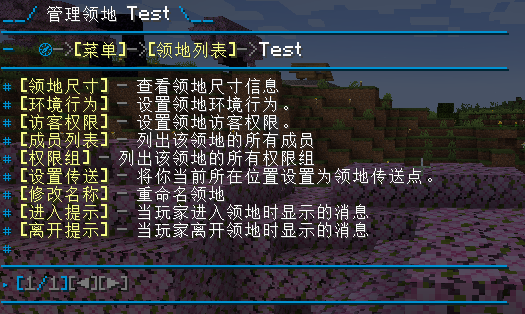

@CUI

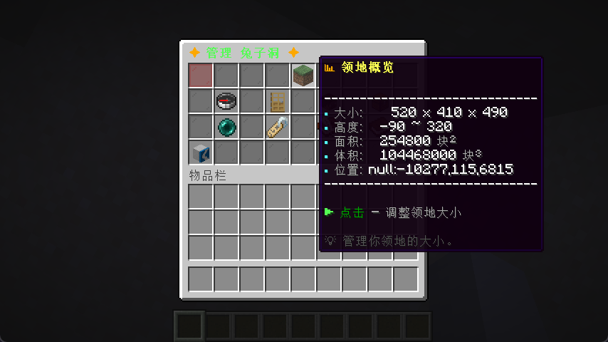

:::

## 领地环境设置

领地环境行为主要指的是一些与玩家无直接关联的事件，例如苦力怕爆炸、火焰蔓延、特定生物的生成等。 通过关闭相关的行为可以避免一些非人为情况对领地造成破坏。

打开对应领地的管理页面，点击 `【环境行为】`：

:::tabs

@tab TUI

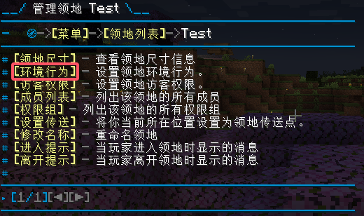

@tab CUI

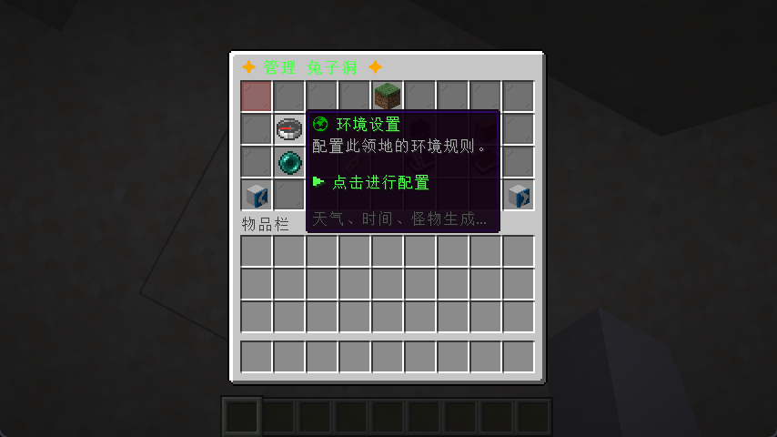

:::

随后即可启用或关闭对应的领地内行为：

:::tabs

@tab TUI

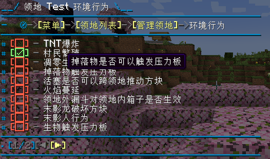

@tab CUI

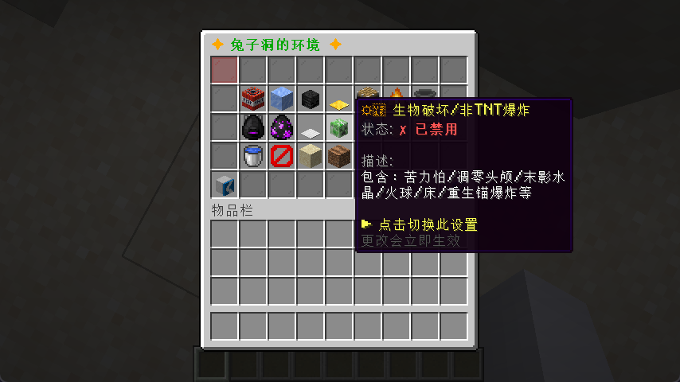

:::

## 配置访客权限

访客是相对于成员的概念，当一个玩家不属于领地的成员时他就是访客，受访客权限控制。

打开对应领地的管理页面，点击 `【访客权限】`：

:::tabs
@tab TUI
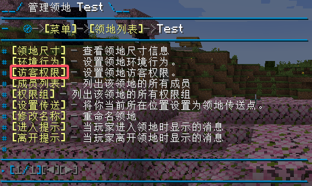
@tab CUI
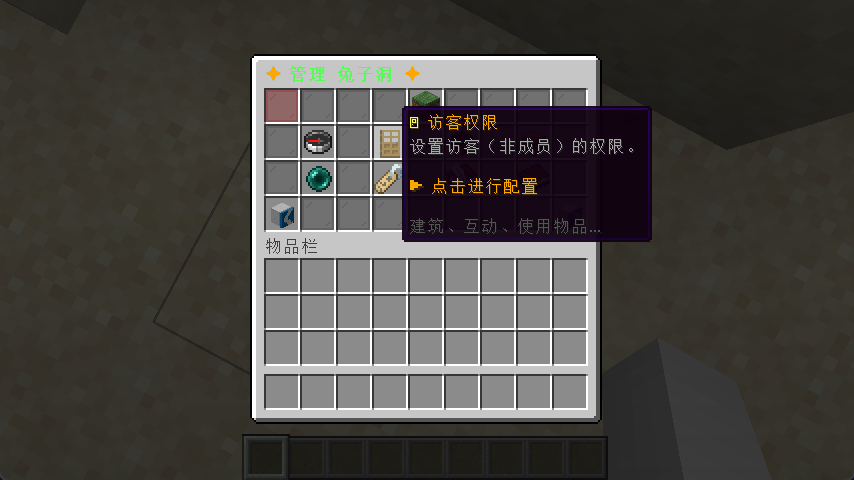
:::

随后即可配置访客在此领地的行为：

:::tabs

@tab TUI

绿色的 ☑ 表示启用，红色的 ☐ 表示禁用，将鼠标移动到对应权限上会显示权限描述。
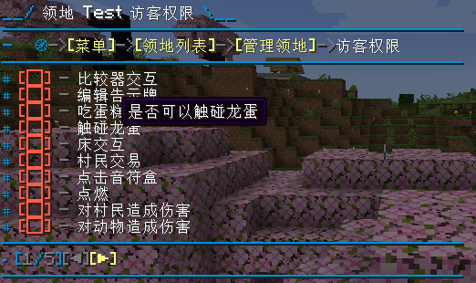

@tab CUI

绿色的 ✔ 表示启用，红色的 ✘ 表示禁用，将鼠标移动到对应权限上会显示权限描述。
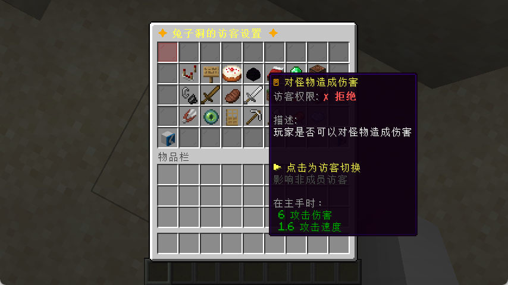

:::

## 修改领地尺寸

:::tabs

@tab TUI

打开对应领地的管理页面，点击 `【领地尺寸】`，可以查看当前领地的尺寸信息：

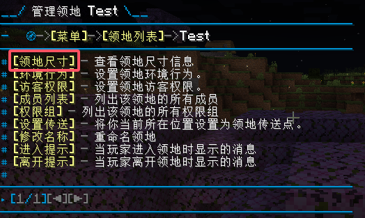
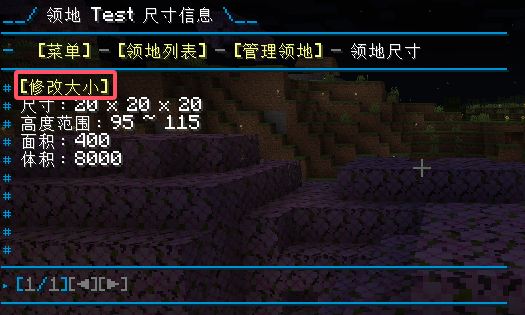

若要修改领地的尺寸可以点击尺寸信息页面的 `【修改大小】`，随后即可打开大小修改页面：

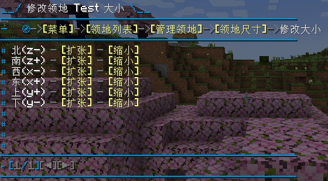

@tab CUI

打开对应领地的管理页面，鼠标移动到领地概览，可以查看当前领地的尺寸信息：


点击领地概览可以打开修改领地尺寸的页面：

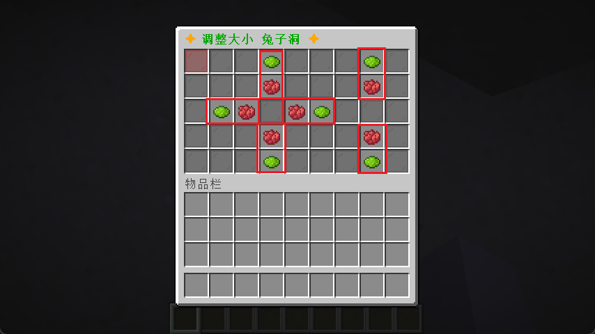

:::

例如我现在希望将领地向北扩张10格，那么点击 `北（Z-）【扩张】` 随后在聊天栏中输入要扩张的格数 `10`：

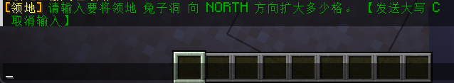

回车发送即可修改领地尺寸。

## 其他设置

### 领地传送

玩家可以使用 `/dominion tp <领地名>` 指令传送到指定的领地的传送点。

领地默认使用领地中心作为传送点，如果需要修改传送点可以在领地管理界面点击 `【设置传送】`， 即可将你当前所在位置设置为领地的新传送点。

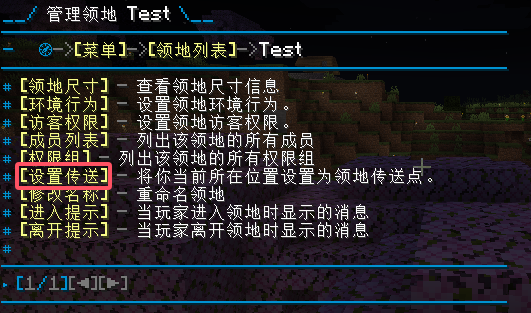

### 提示消息

玩家在进入或离开领地的时候可以看到一则提示消息，通过此消息可以提示玩家当前所在的领地：


要设置提示消息可以在领地管理界面点击 `【进入提示】` 或 `【离开提示】`，分别设置当玩家进入或者离开领地时看到的消息：

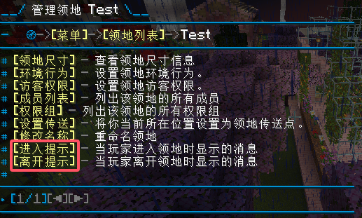
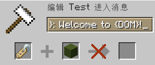

领地提示消息支持 PlaceholderAPI 以及内置的三个特殊占位符：

`{OWNER}`：领地所有者名称；
`{DOM}`：领地名称；
`{PLAYER}`：触发消息的玩家名称；
这三个占位符会被自动替换成对应的内容，以实现更丰富的提示效果。

:::info
本插件内置的三个占位符可以直接使用， 对于 PlaceholderAPI 的占位符，则只有服主正确安装了 PlaceholderAPI 插件后才能使用。
:::

## 删除领地

由于删除领地是一个相对危险的操作，因此虽然在领地列表提供了删除领地的按钮，但是直接点击是无法成功删除的：


仍然需要输入一次指令，才可以删除领地：

```diff:no-line-numbers
/dom delete <领地名称> force
```

:::danger
删除领地会同时删除该领地的所有子领地，并且此操作不可回复。
:::

## 转让领地

通过转让领地可以将领地的所有权移交给其他玩家，不过子领地无法转让， 并且转让领地的同时该领地的所有子领地也会被装让给相应玩家。

转让领地需要使用指令：

```diff:no-line-numbers
/dom give <领地名称> <玩家名称>
```

与删除领地相同，转让领地也是一种较为危险且无法撤销的操作，因此需要在指令后添加 force 参数才能真正转让：

```diff:no-line-numbers
/dom give <领地名称> <玩家名称> force
```

## 子领地

子领地是领地的子区域，每个子领地都有独立的权限系统，且不受其父领地权限影响。

子领地理论上可以无限嵌套（具体深度取决于服主在配置文件中的配置），通过子领地可以实现将你领地中的特殊区域开放给外部玩家等等特殊功能。

要创建子领地请先使用圈地工具（默认为箭矢），依次使用左键点选领地长方体区域的第一个点、右键点击长方体区域的第二个点， 然后使用指令：

```diff:no-line-numbers
/dominion create_sub <子领地名称> <父领地名称>
```

即可完成创建。

## 成员

成员是相对于访客而言的概念，当一个玩家被添加为一个领地的成员后他便不再受到访客权限的影响。

在领地的管理界面点击`【成员列表】`，即可查看当前领地的所有成员：

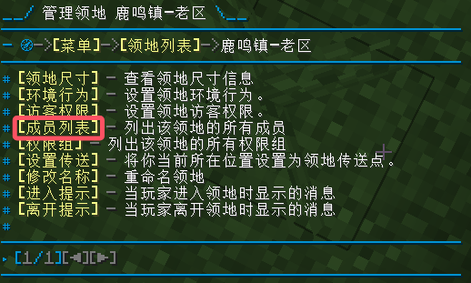
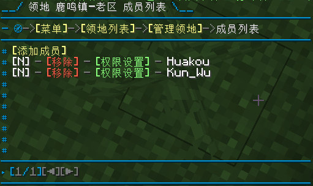

### 为领地添加成员

在成员列表点击`【添加成员】`：

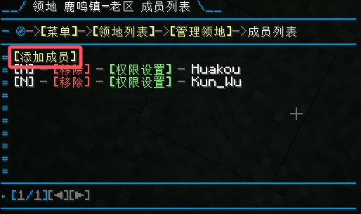

会出现所有登陆过服务器的玩家名称，点击玩家名称即可将其添加为领地成员：

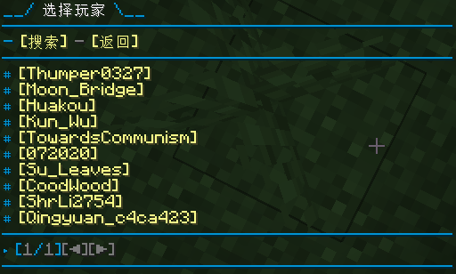

如果玩家太多，在列表中寻找起来太困难，可以点击玩家列表上的`【搜索】`直接输入玩家游戏昵称添加：

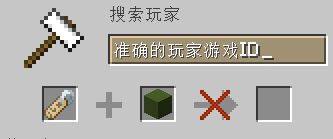

:::warning
必须要输入准确的玩家游戏ID，不支持模糊搜索。
:::

### 配置领地成员权限

在成员列表点击对应成员前的`【权限设置】`即可配置此成员在领地内的权限：

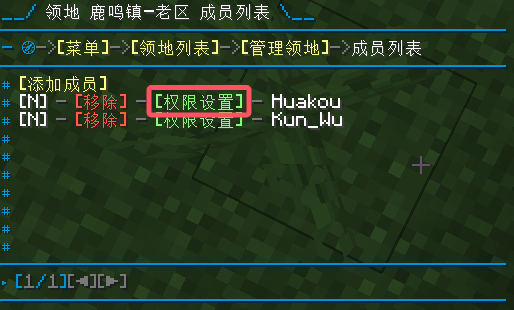
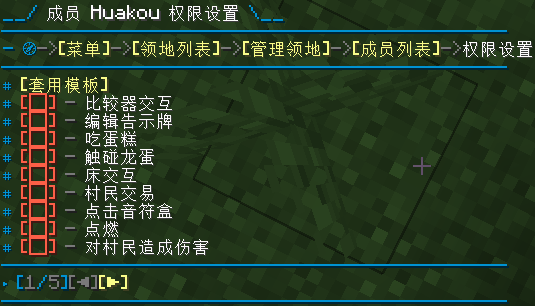

### 从领地移除成员

要想将一个成员移出领地，在成员列表点击对应成员前的`【移除】`即可：

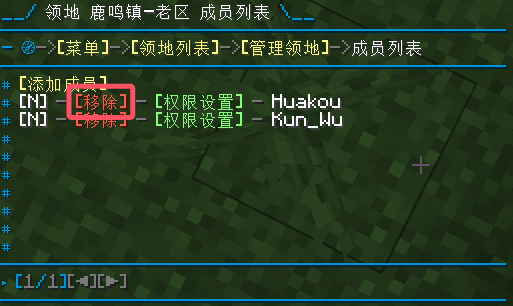

:::info
当玩家不再是领地成员后，其将自动变为访客，收到访客权限控制。
:::

### 权限模板

权限模板是预先定义的若干组权限，通过权限模板你可以快速为成员设置预先定义好的权限规则，避免重复劳动。

创建
要想使用权限模板，需要先创建。

在主菜单点击`【权限模板】`，进入模板列表：

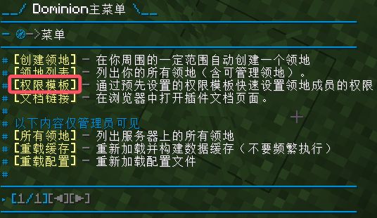

点击列表顶部的`【创建】`，根据提示输入模板名称即可创建一个权限模板：

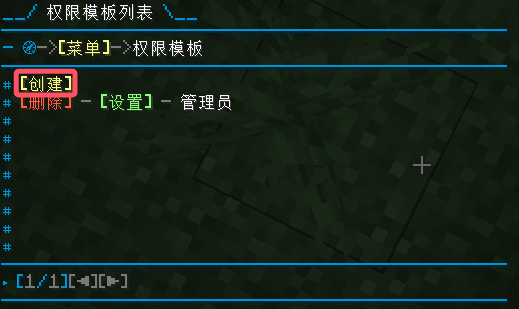

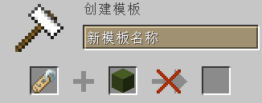

配置
在模板列表点击对应模板前的`【设置】`即可设置此模板的权限配置：

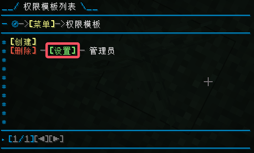

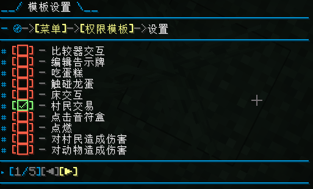

使用
配置完模板后即可套用到其他玩家身上，在对应玩家的权限配置页面点击`【套用模板】`：

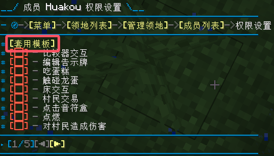

随后即可看到刚才创建的权限模板，点击要使用的模板前的`【套用】`，即可将模板的权限组合应用到此玩家身上：

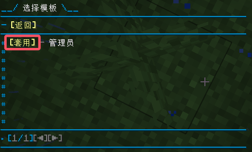

:::tip
当你修改模板的权限后之前套用过的玩家的权限不会受到影响，因为模板套用是单向的。 你也可以在套用模板后再进一步调整玩家的权限以满足精细化控制的需求，这也不会反向影响模板的配置。

如果你希望同时配置多个玩家的权限，请参照[**权限组功能**](./dominion.md#权限组)。
:::

## 权限组

通过将成员添加到权限组中，您可以轻松地为多个成员分配相同的权限。这样，您就不必为每个成员单独设置权限，从而节省了时间和精力。

为了简化权限结构，当成员被添加到权限组后则不可再单独为其设置权限，如果希望单独设置组内某个成员的权限请将其移出权限组。

在领地的管理界面点击`【权限组】`，即可查看当前领地的所有权限组：

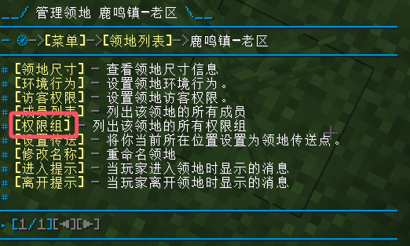

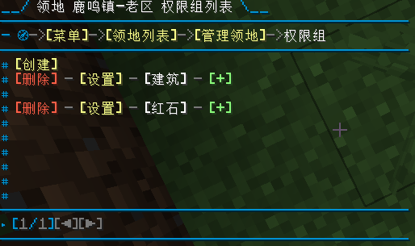

### 为领地创建权限组

在权限组列表页面，点击页面顶部的`【创建】`，按照提示输入权限组名称即可创建：

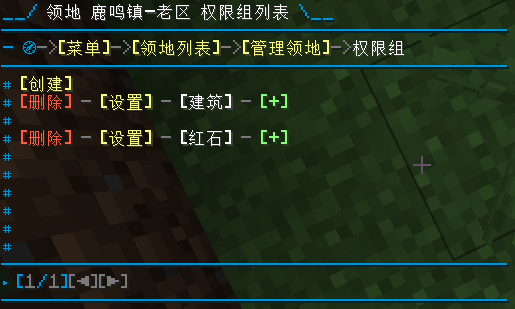

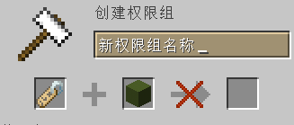

### 添加成员到权限组

点击对应权限组后面的`【+】`进入选择成员页面：

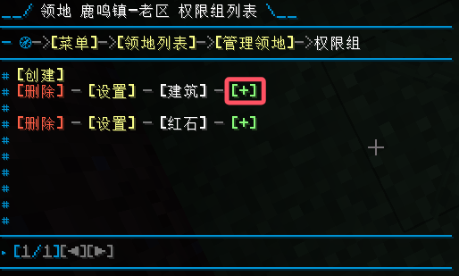

点击要添加到权限组的领地成员，即可：

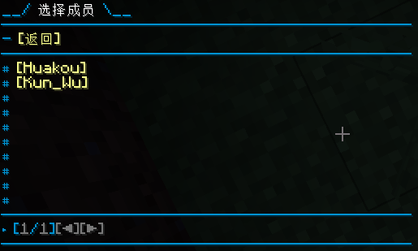

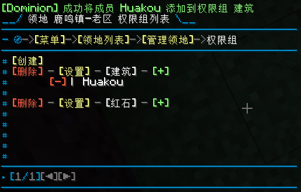

:::tip
需要先将玩家添加为领地的成员，然后才能添加到权限组。
一个领地成员只能属于一个权限组，不能同时属于多个权限组。
:::

### 将成员移出权限组

在权限组列表，找到相关权限组以及权限组下的成员。 点击对应成员前的`【-】`即可将其移出权限组：

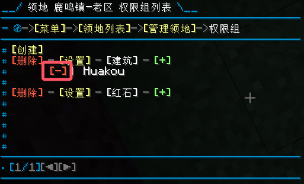

### 删除权限组

在权限组列表中找到要删除的权限组，点击权限组前的【删除】即可删除权限组：

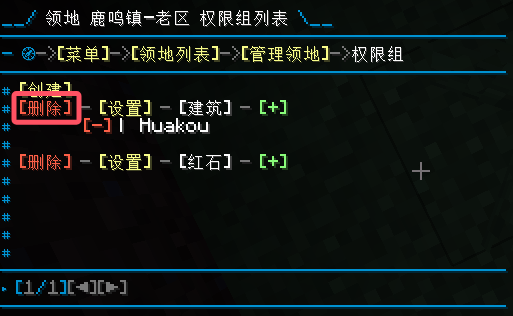

:::info
当权限组删除后，权限组内的玩家会被自动移出权限组（不是移出领地）， 因此可以放心操作。
:::

## 指令一览

:::info
以下指令参数 <> 表示必填项，[] 表示选填项。
:::

### 主菜单

| 指令名称&描述 | 用法 |
| --- | --- |
| 打开主菜单：打开插件的主菜单界面。 | /dominion menu [page] |

### 创建与删除

| 指令名称&描述 | 用法 |
| --- | --- |
| 创建领地：创建一个新的领地。 | /dominion create \<name> |
| 自动创建领地：自动创建一个新的领地。 | /dominion auto_create \<name> |
| 创建子领地：在指定领地下创建一个子领地。 | /dominion create_sub \<name> <dominion/name> |
| 自动创建子领地：自动在指定领地下创建一个子领地。 | /dominion auto_create_sub \<name> <dominion/name> |
| 删除领地：删除指定的领地。 | /dominion delete <dominion/name> [force] |

### 领地管理

| 指令名称&描述 | 用法 |
| --- | --- |
| 调整领地大小：扩展或收缩领地的大小。 | /dominion resize <dominion/name> <expand\|contract> \<size> [north\|east\|south\|west\|up\|down] |
| 设置环境标志：设置领地的环境标志。 | /dominion set_env <dominion/name> <env_flag_name> <true\|false> [page] |
| 设置访客标志：设置领地的访客标志。 | /dominion set_guest <dominion/name> <guest_flag_name> <true\|false> [page] |
| 设置地图颜色：设置领地在地图上的显示颜色。 | /dominion set_map_color <dominion/name> \<color> |
| 设置传送点：设置领地的传送点。 | /dominion set_tp <dominion/name> |
| 设置消息：设置进入或离开领地时的提示消息。 | /dominion set_msg <dominion/name> <enter\|leave> \<message> |
| 重命名领地：修改领地的名称。 | /dominion rename <dominion/name> \<newName> |
| 转让领地：将领地转让给其他玩家。 | /dominion give <dominion/name> <player_name> [force] |

### 成员管理

| 指令名称&描述 | 用法 |
| --- | --- |
| 添加成员：向领地添加新成员。 | /dominion member_add <dominion/name> <player_name> |
| 移除成员：从领地中移除指定成员。 | /dominion member_remove <dominion/name> <member_name> [page] |
| 设置成员权限：设置成员的权限标志。 | /dominion member_set_pri <dominion/name> <member_name> <pri_flag_name> <true\|false> [page] |

### 权限组管理

| 指令名称&描述 | 用法 |
| --- | --- |
| 创建权限组：为领地创建一个新的权限组。 | /dominion group_create <dominion/name> <group_name> |
| 设置权限组标志：设置权限组的权限标志。 | /dominion group_set_flag <dominion/name> <group_name> <pri_flag_name> <true\|false> [page] |
| 添加组成员：向权限组中添加成员。 | /dominion group_add_member <dominion/name> <group_name> <member_name> |
| 移除组成员：从权限组中移除成员。 | /dominion group_remove_member <dominion/name> <group_name> <member_name> [page] |
| 重命名权限组：修改权限组的名称。 | /dominion group_rename <dominion/name> <group_name> <new_group_name> |
| 删除权限组：删除指定的权限组。 | /dominion group_delete <dominion/name> <group_name> [page] |

### 模板管理

| 指令名称&描述 | 用法 |
| --- | --- |
| 应用模板：将权限模板应用到指定成员。 | /dominion member_apply_template <dominion/name> <member_name> <template_name> |
| 创建模板：创建一个新的权限模板。 | /dominion template_create <template_name> |
| 删除模板：删除指定的权限模板。 | /dominion template_delete <template_name> [page] |
| 设置模板标志：设置模板的权限标志。 | /dominion template_set_flag <template_name> <pri_flag_name> <true\|false> [page] |

### 杂项

| 指令名称&描述 | 用法 |
| --- | --- |
| 使用称号：使用指定的称号。 | /dominion title_use <title_id> [page] |
| 迁移数据：将其他插件的数据迁移到本插件。 | /dominion migrate <residence_name> [page] |
| 传送到领地：传送到指定的领地。 | /dominion tp <dominion/name> |

## 参考资料

1. <https://dominion.lunadeer.cn/>
